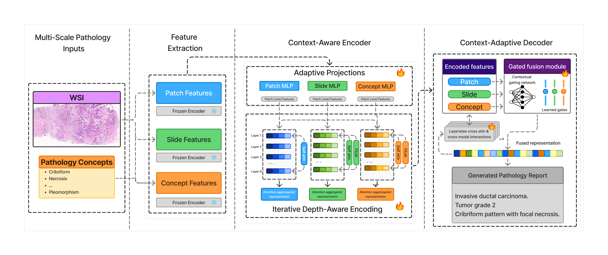

# SCOUT: Semantic Context-aware Modality Fusion Transformer

SCOUT is a context-aware, concept-grounded multimodal framework for pathology report generation from whole-slide images (WSIs). It integrates local histomorphology, global tissue context, and explicit diagnostic concepts, progressively refining these complementary representations throughout encoding and adaptively fusing them during autoregressive report generation.

The name expands to **S**emantic **C**ontext-aware m**O**dality f**U**sion **T**ransformer. The central motivation is that the significance of a local histologic pattern depends on its surrounding tissue architecture, disease context, and relationship to established diagnostic concepts. Instead of treating pretrained representations as fixed, interchangeable inputs, SCOUT maintains distinct but interacting patch, slide-conditioned, and concept-conditioned streams.

> **Research use only.** This repository is an experimental research implementation and is not intended for clinical diagnosis or patient care.

## Architecture



SCOUT consumes three complementary, precomputed feature streams:

1. **Patch features:** frozen CONCHv1.5 embeddings capture fine-grained local morphology from non-overlapping 512 × 512 tissue patches at 20× magnification.
2. **Slide context:** a TITAN whole-slide embedding and GECKO deep representation are independently adapted, concatenated, and fused to encode global tissue architecture.
3. **Concept context:** GECKO produces case-specific features over a fixed, expert-curated diagnostic concept vocabulary. Target-report text is not used to construct these features at inference time.

Modality-specific adapters project the heterogeneous inputs into a shared latent space, and a learned visual prompt is prepended to the patch sequence. At every encoder depth, patch features pass through Transformer self-attention and spatial aggregation. The evolving patch representation is then independently modulated by the current slide and concept states using feature-wise linear modulation (FiLM). Mean-pooled conditioned features recursively update those contextual states for the next layer. Learned stream-specific depth weights aggregate the patch, slide-conditioned, and concept-conditioned representations across all encoder layers.

Each decoder layer performs causal self-attention followed by three independent cross-attention paths—one per encoded stream. A feature-wise, multi-head gating network normalizes weights across the three modalities and fuses their cross-attended representations before the feed-forward block and next-token prediction. The retained attention tensors and gate weights support cohort-level modality analysis and case-level spatial visualization; as stated in the manuscript, these are model-internal attribution signals rather than causal explanations.

The feature extractors that produce the HDF5 files are external to the training loop. Only the adapters, context-aware encoder, gated decoder, learned prompt, and output head are trained by this repository.

### Main contributions

- **Iterative context co-evolution:** slide and concept states are recursively updated as patch representations evolve through encoder depth.
- **Depth-aware stream aggregation:** learned weights independently combine representations from every encoder layer for each modality.
- **Adaptive three-way decoding:** token-dependent, feature-wise gates fuse separate patch, slide-conditioned, and concept-conditioned cross-attention paths.
- **Inspectable modality use:** retained cross-attention maps and normalized gate weights enable report-level spatial and cohort-level contribution analyses.

## Manuscript evaluation

The manuscript evaluates SCOUT on 20,905 WSI–report pairs across three heterogeneous settings:

| Dataset | Train / validation / test | Scope | Report characteristics |
|---|---:|---|---|
| TCGA-BRCA (PathText subset) | 844 / 90 / 90 | Breast cancer | Free-form clinical reports |
| HistAI | 9,980 / 1,248 / 1,248 | Multi-cancer | Heterogeneous reports |
| REG-2025 | 5,924 / 740 / 741 | Multi-cancer | Comparatively standardized reports |

Using fixed case-level splits, identical CONCHv1.5 patch features, and common preprocessing, the paper compares SCOUT with WSI-Caption, HistGen, and Bi-Gen. SCOUT achieved the strongest BLEU-1 through BLEU-4 and METEOR results across all three datasets. It also achieved the strongest ROUGE-L on TCGA-BRCA and REG-2025; Bi-Gen was slightly higher on HistAI ROUGE-L. On REG-2025, SCOUT obtained a Clinical Report Quality Score (CRQS) of 0.7376, a 5.6% relative improvement over the strongest baseline.

## Repository layout

```text
SCOUT/
├── main.py                         # Typer CLI: train, test, and predict
├── models.py                       # Lightning module and visualizations
├── trainer.py                      # Trainers, checkpoints, and DDP setup
├── report_tokenizers.py            # Vocabulary and report cleaning
├── config.yaml                     # Example experiment configuration
├── datamodules/                    # Train/val/test and prediction loaders
├── embedding_datasets/             # HDF5 feature and report loading
├── modules/
│   ├── report_gen_model.py         # Feature adapters and composition
│   ├── transformer.py              # Transformer and gated fusion
│   ├── encoder.py                  # Depth-aware context encoder
│   ├── decoder.py                  # Three-stream cross-attention decoder
│   ├── loss.py                     # Language-model loss
│   └── metrics.py                  # Caption and REG metrics
├── notebooks/                      # Experimental feature workflows
├── generate_reports_data.py        # Build report metadata from PathText/TCGA
├── generate_thumbnail.py           # Create WSI thumbnails for overlays
└── modules/pycocoevalcap/          # Vendored COCO evaluation code
```

`train.py` and `test.py` are legacy argparse entry points. The supported interface is the Typer CLI in `main.py`.

## Requirements

- Python 3.12
- A CUDA-capable GPU; the trainer and data collation paths explicitly target CUDA
- Java, if METEOR evaluation is enabled through the vendored JAR
- OpenSlide for WSI thumbnails (Pillow is a fallback for compatible images)

Activate the shared Python 3.12 Conda environment and install the pinned dependencies:

```bash
conda activate scout
python -m pip install --upgrade pip
python -m pip install -r requirements.txt
```


The dependency file includes CUDA packages, FlashAttention, the TRIDENT Git dependency, and `en_core_sci_lg`. Installation therefore requires a compatible CUDA/PyTorch toolchain and network access. For metric-only environments, `reg_metrics_requirements.txt` contains the smaller REG evaluation dependency set.

## Data preparation

### Report splits

`reports_json_path` must point to a JSON object with explicit `train`, `val`, and `test` splits. Every item needs an `id` and a `report`:

```json
{
  "train": [{"id": "case_001", "report": "invasive ductal carcinoma ..."}],
  "val": [{"id": "case_002", "report": "benign breast tissue ..."}],
  "test": [{"id": "case_003", "report": "high-grade carcinoma ..."}]
}
```

The same case ID must be present in all three feature directories. Dataset loading intersects filenames across the directories and the selected report split.

### Feature files

SCOUT expects one HDF5 file per case in each feature directory:

```text
features/
├── slide/case_001.h5
├── patch/case_001.h5
└── gecko/case_001.h5
```

| Configuration key | HDF5 dataset | Role | Input width |
|---|---|---|---|
| `embeddings_path` | `features` | TITAN slide representation | `d1` |
| `embeddings_path_2` | `features` | CONCHv1.5 patch representations | `d2` |
| `gecko_emb_path` | `bag_feats_deep` | GECKO deep slide representation | `gd` |
| `gecko_emb_path` | `bag_feats` | GECKO concept representation | `gcd` |

Arrays are loaded as sequences and padded within each batch. Keep matching filenames across all directories. The dataset derives the report key by removing the `.h5` suffix; IDs containing additional periods may require adapting that normalization.

The manuscript's offline preprocessing pipeline uses TRIDENT for tissue segmentation and tiling, CONCHv1.5 for patch encoding, TITAN for slide encoding, and GECKO for deep and concept-level representations. All feature streams are stored before SCOUT training. Feature extraction is not yet packaged here as a single standalone command; the notebooks contain the experimental TITAN and CONCH workflows, while `tcga_concepts.json` contains diagnostic concept definitions.

## Configuration

Commands read the `train` mapping from a YAML file. `config.yaml` records an earlier experiment and contains machine-specific paths; it is not a complete portable configuration for the current model. Use the schema below when creating a configuration. The actively used settings are:

| Group | Keys |
|---|---|
| Data | `dataset_type`, `reports_json_path`, `embeddings_path`, `embeddings_path_2`, `gecko_emb_path`, `max_seq_length`, `batch_size`, `num_workers` |
| Feature dimensions | `d1`, `d2`, `gd`, `gcd`, `d_vf` |
| Transformer | `d_model`, `d_ff`, `num_heads`, `num_layers`, `dropout_mlp`, `drop_prob_lm`, `use_bn` |
| Optimization | `lr`, `weight_decay`, `lr_patience`, `concept_lambda`, `max_epochs` |
| Decoding | `bos_idx`, `eos_idx`, `pad_idx`, `sample_method`, `beam_size`, `sample_n`, `group_size`, `temperature`, `length_penalty`, `decoding_constraint`, `suppress_UNK`, `block_trigrams`, `output_logsoftmax` |
| Runtime/output | `devices`, `fast_dev_run`, `resume`, `ckpt_path`, `model_load_path`, `results_path` |
| Unlabelled prediction | `predict_embeddings_path_1`, `predict_embeddings_path_2`, `gecko_predict_emb_path` |

The tokenizer reserves ID `0` for beginning-of-sequence, end-of-sequence, and padding, so the corresponding values should remain `0` unless the tokenizer changes.

A minimal shape-and-path example is:

```yaml
train:
  dataset_type: histai
  reports_json_path: /path/to/reports.json
  embeddings_path: /path/to/slide_features
  embeddings_path_2: /path/to/patch_features
  gecko_emb_path: /path/to/gecko_features

  d1: 768
  d2: 768
  gd: 768
  gcd: 768
  d_vf: 768
  d_model: 768
  d_ff: 768
  num_heads: 4
  num_layers: 4
  dropout_mlp: 0.2
  drop_prob_lm: 0.2
  use_bn: 0

  # Paper values: REG-2025 320; TCGA-BRCA 600; HistAI 800
  max_seq_length: 320
  batch_size: 1
  num_workers: 2
  max_epochs: 100
  lr: 0.00007
  weight_decay: 0.001
  lr_patience: 5
  concept_lambda: 0.0

  bos_idx: 0
  eos_idx: 0
  pad_idx: 0
  sample_method: beam_search
  beam_size: 10
  sample_n: 1
  group_size: 5
  temperature: 1.5
  length_penalty: wu_0.9
  decoding_constraint: 1
  suppress_UNK: 1
  block_trigrams: 1
  output_logsoftmax: 1

  devices: "0"
  fast_dev_run: false
  resume: false
  ckpt_path: /path/to/checkpoints
  model_load_path: /path/to/model.ckpt
  results_path: /path/to/results
```

Each input width must match the final dimension of its HDF5 array. `d_vf` is the common projected width and must match `d_model` in the current implementation. The example reflects the principal manuscript hyperparameters: AdamW, learning rate 7 × 10⁻⁵, weight decay 10⁻³, batch size 1, 100 maximum epochs, patience 5, latent dimension 768, four Transformer layers, four attention heads, and dropout 0.2. Dataset-specific maximum report lengths are 320 for REG-2025, 600 for TCGA-BRCA, and 800 for HistAI.

## Usage

Inspect commands and options:

```bash
python main.py --help
python main.py train --help
```

### Train and evaluate

```bash
python main.py train --config-file-path config.yaml --notes "SCOUT baseline"
```

Training uses PyTorch Lightning DDP, saves the best and last checkpoints beneath a timestamped `ckpt_path`, and runs a final test pass with the best checkpoint. Set `fast_dev_run: true` for a one-batch development check.

The manuscript reports AdamW optimization, ReduceLROnPlateau scheduling, early stopping after five epochs without improvement, and checkpoint selection by validation loss. The current `Trainer` implementation instead selects and early-stops on validation BLEU-1. Change the callback monitors to `val_loss` when reproducing the exact manuscript protocol.

### Evaluate a checkpoint

Set `model_load_path`, then run:

```bash
python main.py test --config-file-path config.yaml
```

### Predict an unlabelled cohort

Add the three prediction feature paths to the configuration and run:

```bash
python main.py predict --config-file-path config.yaml
```

Predictions are written to `<results_path>/predicted_results/predictions.json`.

### Generate test-cohort gate plots

```bash
python main.py predict-test-cohort --config-file-path config.yaml --layer-idx -1
```

This evaluates the labelled test split and saves predictions plus decoder gate-contribution plots under `results_path`. `layer_idx=-1` selects the last decoder layer.

### Inspect a single case

```bash
python main.py predict-case \
  --config-file-path config.yaml \
  --case-index 0 \
  --output-dir /path/to/case_outputs \
  --layer-idx -1 \
  --wsi-dir /path/to/wsis
```

The command generates the report and modality/gate visualizations for one test item. If `wsi_dir` is supplied, SCOUT locates a matching WSI and creates a thumbnail for spatial overlays.

## Training objective and evaluation

The optimization objective combines token-level language-model loss with attention-entropy regularization:

```text
total loss = caption loss + concept_lambda × attention entropy
```

The manuscript reports BLEU-1 through BLEU-4, METEOR, and ROUGE-L on all datasets. REG-2025 is additionally evaluated using CRQS from PathReportEval, which combines Clinical Fact Coverage, Key Information Recall, Hallucination Rate, and Clinical Discordance Score. Higher CRQS indicates closer agreement with clinically relevant reference-report content.

The repository's vendored COCO evaluator also exposes CIDEr, and `modules/metrics.py` contains an older REG composite evaluator. These are implementation utilities and should not be confused with the manuscript's CRQS evaluation protocol.

## Outputs

A training run creates a timestamped directory below `ckpt_path` containing:

- the best checkpoint and `last.ckpt`;
- a copy of the experiment YAML;
- `results/results.csv` with training and test metrics.

An experiment row is also appended to `<results_path>/experiments/results.csv`. Prediction and interpretability commands write JSON reports and PNG visualizations beneath `results_path` or the supplied output directory.

## Reproducibility notes

- Lightning is seeded with `42`.
- The CLI enables medium-precision float32 matrix multiplication and autograd anomaly detection.
- Training is GPU/DDP-oriented; CPU-only execution requires code changes.
- Vocabulary is built from every split in `reports_json_path`, not only training. Account for this in strict evaluation protocols.
- Paths in `config.yaml` are environment-specific and not portable.
- Checkpoint loading requires the same vocabulary and model dimensions used during training.

## Acknowledgements

The implementation uses PyTorch Lightning and adapted COCO caption-evaluation components under `modules/pycocoevalcap`, with the original license files preserved. The experimental environment also depends on [TRIDENT](https://github.com/mahmoodlab/TRIDENT) for pathology tooling.
